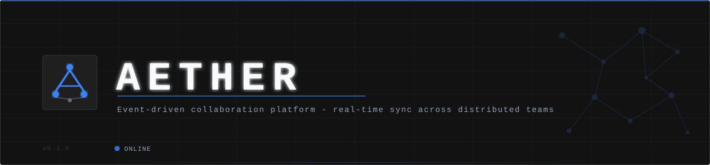

  

 

## AETHER

AETHER es una plataforma de gestión y colaboración centrada en proyectos. Conecta el ingreso de iniciativas, su formalización, la planificación del trabajo y la colaboración diaria en un mismo entorno. Esta guía describe los componentes que existen en este repositorio y cómo se relacionan.

**Estado del producto:** MVP en evolución. El núcleo de organizaciones, espacios de trabajo, proyectos, tareas, documentos, calendario, contactos y notificaciones está acompañado por capacidades de iniciativas, portafolios y redes para contextos institucionales. Algunas funciones dependen del plan de la organización y de la configuración de proveedores externos.

## Índice

[Modelo de dominio](#modelo-de-dominio), [Capacidades](#capacidades-del-producto), [Permisos](#identidad-y-permisos), [Arquitectura](#arquitectura-técnica), [API](#superficie-de-la-api), [Configuración](#desarrollo-local-y-configuración), [Pruebas](#calidad-y-ci), [Despliegue](#despliegue-y-operación), [Estructura](#estructura-del-repositorio), [Documentación](#documentación-relacionada).

## Modelo de dominio

Las entidades representan niveles distintos de gobierno y ejecución. La organización controla la cuenta y sus capacidades. El espacio de trabajo define el contexto de colaboración. El proyecto reúne el objetivo, las personas y los recursos necesarios para entregar un resultado.

| Entidad                  | Responsabilidad en AETHER                                                                                                                                                                               |
| ------------------------ | ------------------------------------------------------------------------------------------------------------------------------------------------------------------------------------------------------- |
| Organización             | Cuenta de gobierno y facturación. Agrupa espacios de trabajo, membresías, invitaciones, suscripción y capacidades habilitadas. Puede ser personal, empresa, institución u operador de red.              |
| Espacio de trabajo       | Contexto operativo asociado a una organización. Define miembros, plantillas y estándares compartidos. Sus modos actuales son personal, equipo e institucional.                                          |
| Iniciativa               | Solicitud u oportunidad previa al proyecto. Puede pasar por ingreso, triage, diagnóstico, validación, aprobación, rechazo, pausa o archivo, y convertirse en proyecto.                                  |
| Proyecto                 | Unidad principal de planificación y ejecución. Contiene estado, responsables, miembros, equipos asignados, hitos, tableros, documentos y actividad.                                                     |
| Tablero, lista y tarjeta | Jerarquía para organizar el trabajo. Un tablero contiene listas y cada lista contiene tarjetas. Las tarjetas admiten responsables, prioridad, fechas, etiquetas, checklist, comentarios y dependencias. |
| Equipo                   | Grupo reutilizable de personas que puede colaborar en proyectos. Su asignación da contexto de trabajo, pero el acceso al proyecto se resuelve mediante las reglas de autorización del proyecto.         |
| Documento                | Contenido de trabajo con permisos, versiones y comentarios. Puede pertenecer al espacio de trabajo o estar vinculado explícitamente a un proyecto.                                                      |
| Evento                   | Actividad personal, del espacio de trabajo o de un equipo. Los eventos personales pueden invitar contactos, cuyas invitaciones tienen estado pendiente, aceptado o rechazado.                           |
| Portafolio               | Agrupación organizacional para supervisar proyectos, capacidad, alertas e informes sin reemplazar el acceso a cada espacio o proyecto.                                                                  |
| Red y programa           | Estructuras para colaboración entre organizaciones, convocatorias, incubadoras, desafíos, fondos y mentorías. Incluyen invitaciones, permisos externos y evaluaciones.                                  |

### Límites entre contextos

La membresía de una organización no implica automáticamente acceso a todos sus recursos. La membresía de un espacio tampoco concede a todos sus miembros acceso a todos los proyectos. Los proyectos tienen una política propia que considera propiedad, administración del espacio, miembros directos, equipos asignados, roles operativos y concesiones externas vigentes.

Los documentos de espacio conservan su alcance general. Los documentos de proyecto se asocian a un único proyecto del mismo espacio de trabajo. Esta regla mantiene separadas las plantillas compartidas y la evidencia específica de una iniciativa.

## Capacidades del producto

### Cuentas, organizaciones y espacios

El flujo de cuenta incluye registro, validación de correo, inicio y cierre de sesión, renovación de sesión y recuperación de contraseña. Las personas pueden pertenecer a más de una organización y aceptar invitaciones a organizaciones, espacios y equipos. Una organización puede permanecer activa aunque todavía no tenga espacios de trabajo.

La organización administra miembros, roles, invitaciones, propiedad y capacidades de suscripción. Los espacios de trabajo contienen proyectos y documentos, y establecen el contexto operativo personal, de equipo o institucional.

### Proyectos, iniciativas y formalización

Los proyectos recogen el objetivo, el problema u oportunidad, el estado, las personas, los equipos, los tableros y los hitos. El espacio puede definir un estándar y una lista de requisitos para orientar la formalización. La actividad del proyecto mantiene trazabilidad de los cambios relevantes.

Las iniciativas ofrecen un flujo previo para recibir y evaluar propuestas. Los participantes pueden tener responsabilidades diferenciadas, como solicitante, coordinador de triage, mentor, evaluador, líder de proyecto o colaborador. Una iniciativa aprobada puede convertirse en proyecto para continuar su planificación y ejecución.

### Planificación y ejecución

Los tableros organizan listas y tarjetas. Una tarjeta puede tener asignaciones, etiquetas, prioridad, fechas de inicio y vencimiento, checklist, comentarios, dependencias y referencias a documentos. Los servicios de planificación reúnen el backlog y datos de cronograma a nivel de proyecto. El acceso a operaciones de lectura, contribución y administración se valida en la API.

Los proyectos pueden asociarse a hitos y equipos. La asignación o retiro de un equipo se refleja en los proyectos asociados. Los roles operativos permiten asignar responsabilidades propias del ciclo del proyecto, además de la membresía general.

### Portafolios y capacidad

Los portafolios presentan información consolidada de proyectos, alertas y capacidad de las personas. Admiten asignaciones de disponibilidad y capacidad a proyectos, administración de miembros y exportación de informes. Su membresía es independiente de la membresía a organizaciones, espacios y proyectos.

### Redes y programas

Las redes conectan organizaciones participantes y sus miembros. Dentro de una red se pueden gestionar programas, iniciativas asociadas, criterios de evaluación e invitaciones externas. Las concesiones de acceso se limitan a un recurso concreto, pueden revocarse y pueden tener fecha de expiración.

### Documentos colaborativos

La biblioteca diferencia documentos generales del espacio de trabajo y documentos vinculados a proyectos. El editor permite edición colaborativa en tiempo real, control de permisos, versiones, restauración de versiones, comentarios y exportación a PDF. Los estados colaborativos se sincronizan con Yjs y se guardan en PostgreSQL con escritura diferida para agrupar cambios frecuentes.

### Calendario

El calendario organiza eventos personales, de espacio y de equipo, con fechas, duración, eventos de día completo y color. En un evento personal se puede invitar a uno o más contactos elegibles, aunque no compartan el mismo espacio. La invitación aparece en notificaciones y en la agenda de la persona invitada. La respuesta se registra como aceptada o rechazada; antes de responder se informa si coincide con otros eventos de su calendario.

### Contactos, chat y presencia

La red de contactos admite solicitudes y conversaciones directas. Los mensajes se entregan en tiempo real cuando ambas personas están conectadas. La presencia permite expresar disponibilidad como en línea, ausente, no molestar o desconectado. Los mensajes directos caducan a los 30 días; un trabajo del proceso API elimina mensajes vencidos cada hora y limpia conversaciones antiguas sin mensajes.

### Notificaciones y actividad

Las notificaciones reúnen invitaciones y sucesos relevantes de los módulos de colaboración. Se pueden marcar como leídas, resolver o archivar. El archivado se puede deshacer mientras la notificación siga disponible para restauración. Los registros de actividad presentan quién realizó un cambio y a qué recurso afectó, con alcance según el espacio o proyecto. Otro trabajo del proceso API revisa cada hora las tarjetas próximas a vencer y genera un aviso deduplicado por tarjeta, persona y fecha.

### Asistencia de inteligencia artificial

El planificador de espacios usa el proveedor Groq para proponer una estructura inicial a partir de un documento, incluyendo espacio, proyecto, hitos, tableros, listas y tarjetas. El constructor materializa esa propuesta dentro de una transacción. La disponibilidad requiere configurar el proveedor y respetar los límites de frecuencia y créditos del plan.

### Integraciones y servicios externos

Brevo entrega correos transaccionales, como validación de cuenta e invitaciones. El almacenamiento de archivos puede usar Cloudflare R2 o un directorio local configurado. La integración de GitHub recibe webhooks de espacios de trabajo y verifica su firma antes de procesar los eventos permitidos.

### Planes y capacidades

La API mantiene un catálogo de planes Free o Personal, Teams, Portfolio, Institutional y Network. Los planes determinan límites o capacidades como cantidad de espacios y miembros, portafolios, estándares institucionales, ingreso de iniciativas, redes, analítica, almacenamiento y créditos de IA. Las membresías y permisos siguen siendo necesarios aunque el plan habilite una capacidad.

La siguiente tabla resume los valores base del catálogo de la API. La suscripción activa puede añadir sobrescrituras de capacidades, por lo que el límite efectivo debe consultarse en la organización y no inferirse sólo por el nombre del plan.

| Plan base       | Espacios | Miembros | Portafolio | Contexto institucional e intake | Redes y programas | Analítica | Almacenamiento | Créditos IA |
| --------------- | -------: | -------: | ---------- | ------------------------------- | ----------------- | --------- | -------------: | ----------: |
| Free / Personal |        1 |        1 | No         | No                              | No                | No        |         250 MB |           3 |
| Teams           |        5 |       15 | No         | No                              | No                | No        |      10 000 MB |         100 |
| Portfolio       |       20 |       50 | Sí         | No                              | No                | Sí        |      50 000 MB |         500 |
| Institutional   |      100 |      500 | Sí         | Sí                              | No                | Sí        |     250 000 MB |       2 000 |
| Network         |      250 |    2 000 | Sí         | Sí                              | Sí                | Sí        |   1 000 000 MB |      10 000 |

## Identidad y permisos

La API valida tokens de acceso JWT en rutas protegidas. La autenticación de tiempo real también verifica el token antes de aceptar una conexión. El flujo de cuentas usa tokens de acceso y renovación, y los secretos de firma deben tener al menos 32 caracteres.

| Ámbito             | Reglas principales                                                                                                                                                                                   |
| ------------------ | ---------------------------------------------------------------------------------------------------------------------------------------------------------------------------------------------------- |
| Organización       | Roles de dueño, administrador de facturación, administrador y miembro. La administración de organización cubre miembros, invitaciones, datos de la cuenta y transferencia de propiedad según el rol. |
| Espacio de trabajo | Los roles de dueño y administrador controlan operaciones de gobierno como miembros e invitaciones. Los modos personal, equipo e institucional determinan el contexto de trabajo.                     |
| Proyecto           | Los niveles efectivos son lectura, contribución y administración. Se derivan de propiedad, rol de administración del espacio, membresía directa, equipo asignado, rol operativo o concesión de red.  |
| Portafolio y red   | Sus membresías y concesiones se administran de forma explícita y no conceden implícitamente acceso a todos los espacios o proyectos.                                                                 |

La API aplica límites de frecuencia generales y límites más estrictos para inicio de sesión, registro, recuperación de contraseña y generación con IA. Helmet configura encabezados de seguridad y CORS limita los orígenes permitidos.

## Arquitectura técnica

| Componente            | Tecnología y responsabilidad                                                                                                                                                                                                                                 |
| --------------------- | ------------------------------------------------------------------------------------------------------------------------------------------------------------------------------------------------------------------------------------------------------------ |
| Aplicación web        | Next.js App Router y React con TypeScript. Las rutas de producto viven en `apps/web/src/app/dashboard`; componentes, estado compartido y clientes de API viven bajo `apps/web/src`.                                                                          |
| API                   | Node.js y Express. Las rutas conectan autenticación y autorización con controladores, servicios de dominio e infraestructura. La API sirve además el estado de salud en `/health`.                                                                           |
| Contratos compartidos | `packages/shared-types` publica tipos de eventos y modelos usados por el cliente y la API.                                                                                                                                                                   |
| Base de datos         | PostgreSQL persiste entidades del producto, estado de documentos, relaciones, invitaciones, actividad y eventos durables. Prisma mantiene el esquema y las migraciones; algunos flujos especializados usan SQL parametrizado mediante el pool de PostgreSQL. |
| Redis                 | Conserva datos efímeros de presencia e indicadores de escritura y ofrece el canal Pub/Sub `aether:events`. El subscriber está inicializado, pero su callback no retransmite eventos entre procesos en la implementación actual.                              |
| Socket.io             | Canal autenticado para presencia, conversaciones y eventos de colaboración. Las salas se delimitan por usuario, tablero o espacio según el tipo de evento y su autorización.                                                                                 |
| Yjs                   | Modelo CRDT para sincronizar ediciones concurrentes de documentos. El gateway comprueba permisos, distribuye actualizaciones y persiste el estado con debounce y reintentos.                                                                                 |
| Archivos y correo     | Cloudflare R2 o almacenamiento local para archivos. Brevo para correo transaccional.                                                                                                                                                                         |

### Recorrido de una operación

Una solicitud web llega a la API con un token y el contexto del recurso. Los middlewares validan autenticación, membresía y permiso efectivo; el servicio aplica la regla de negocio y persiste el estado relacional. `EventStoreService` genera eventos con identificador UUID v7, actor, recurso, contexto, delta, payload, correlación y reloj vectorial local. Los eventos no efímeros se guardan en PostgreSQL y luego se intentan publicar en Redis y en las salas Socket.io autorizadas. Un fallo en Redis o Socket.io no revierte la mutación principal. El procesamiento del registro de actividad también es de mejor esfuerzo. La escritura del agregado y la del evento no comparten una transacción global para todos los módulos; hay que revisar el caso de uso concreto antes de asumir atomicidad entre ambas.

El almacén de eventos es parte de una arquitectura orientada a eventos y auditoría, no un event sourcing completo: las tablas relacionales siguen siendo la fuente del estado actual y la API no reconstruye cada agregado reproduciendo eventos. Los eventos clasificados como efímeros no se conservan en `events`. El reloj vectorial se mantiene en memoria por usuario y proceso, no establece orden causal global entre réplicas. Aunque la API publica en Redis, el callback del subscriber está reservado para una implementación posterior; por tanto, no se debe asumir difusión Socket.io entre varias instancias de API. Los eventos asociados a proyectos o documentos tampoco se envían a salas amplias de workspace cuando eso pudiera revelar información fuera de su alcance.

La sincronización documental usa Yjs sobre Socket.io: cada proceso mantiene el documento activo en memoria, emite actualizaciones a las personas conectadas y programa la persistencia en PostgreSQL dos segundos después del último cambio. El guardado intenta hasta tres veces y puede programar un reintento tardío. Esto no acredita persistencia multiinstancia ni sincronización offline duradera: una actualización aún no confirmada en PostgreSQL puede perderse si el proceso termina durante esa ventana. No se usa un servidor `y-websocket` separado.

### Persistencia y migraciones

El esquema principal está definido en `apps/api/prisma/schema.prisma` y las migraciones versionadas viven en `apps/api/prisma/migrations`. Algunos flujos también usan SQL parametrizado con el pool de PostgreSQL. La evolución de documentos de proyecto mantiene mecanismos de migración Prisma y de arranque que deben permanecer sincronizados; consolidarlos está pendiente. Para bases heredadas existe un paso de línea base antes de aplicar migraciones pendientes. La política de migraciones y respaldo está descrita en [el runbook de base de datos](./docs/runbooks/database-migrations.md). Las migraciones ya aplicadas no se editan; los cambios posteriores se publican como migraciones nuevas.

## Superficie de la API

Las rutas REST se montan bajo `/api`. Las rutas protegidas requieren `Authorization: Bearer <token>`, salvo los flujos públicos de autenticación y los webhooks que usan su propio mecanismo de autenticación. Las respuestas usan una estructura común con resultado y datos, o resultado y error.

| Grupo base                                                      | Responsabilidad                                                                                               |
| --------------------------------------------------------------- | ------------------------------------------------------------------------------------------------------------- |
| `/api/auth`                                                     | Registro, inicio y cierre de sesión, validación de correo, renovación de sesión y recuperación de contraseña. |
| `/api/organizations`                                            | Organizaciones, membresías, invitaciones, roles y propiedad.                                                  |
| `/api/workspaces`                                               | Espacios, miembros, invitaciones, configuración, plantillas y conexiones de GitHub.                           |
| `/api/projects`                                                 | Proyectos, estándares, flujo de estado, métricas, backlog, tableros, hitos, equipos, miembros y actividad.    |
| `/api/boards`, `/api/cards`, `/api/labels`, `/api/comments`     | Tableros, listas, tarjetas, etiquetas, asignaciones, checklists, dependencias y comentarios.                  |
| `/api/teams`                                                    | Equipos, membresías, roles, invitaciones, proyectos asociados y actividad.                                    |
| `/api/documents`                                                | Documentos, plantillas, permisos, versiones, comentarios, estado colaborativo y exportación.                  |
| `/api/events`                                                   | Eventos del calendario e invitaciones pendientes, respuestas, edición y eliminación.                          |
| `/api/chat`                                                     | Contactos, solicitudes, presencia, conversaciones, mensajes y lectura.                                        |
| `/api/notifications`                                            | Bandeja de notificaciones, contador, lectura, resolución, archivado y restauración.                           |
| `/api/initiatives`                                              | Ingreso, configuración de estándares, participantes, etapas, conversión e informes.                           |
| `/api/portfolios`                                               | Consolidación, alertas, candidatos a proyecto, disponibilidad, asignación de capacidad e informes.            |
| `/api/networks`                                                 | Organizaciones y miembros de red, programas, invitaciones, concesiones y evaluaciones.                        |
| `/api/presence`, `/api/activity`, `/api/search`                 | Presencia, actividad del espacio y búsqueda global.                                                           |
| `/api/ai`, `/api/billing`, `/api/admin`, `/api/webhooks/github` | Generación asistida, suscripciones, administración y recepción de eventos de GitHub.                          |

La lista describe grupos funcionales, no sustituye la validación de permisos ni enumera todos los métodos de cada recurso. Las rutas concretas están organizadas en `apps/api/src/routes` y la lógica de dominio en `apps/api/src/services`.

## Desarrollo local y configuración

El entorno de desarrollo usa Node.js 20 o superior, Corepack, la versión de pnpm fijada en `package.json` y Docker para PostgreSQL y Redis. El archivo `docker-compose.yml` inicia PostgreSQL de desarrollo y Redis; no levanta la API ni el frontend.

Desde la raíz del repositorio, instala dependencias con `corepack pnpm install` y levanta los servicios de datos con `docker compose up -d postgres redis`. Configura las variables requeridas para la API y las URLs públicas que usará el frontend. Después aplica las migraciones de desarrollo con `corepack pnpm --dir apps/api run db:migrate` y arranca las aplicaciones con `corepack pnpm dev`.

El frontend de desarrollo usa el puerto 3002. La API usa `API_PORT`, cuyo valor predeterminado es 3000; algunos valores de fallback del cliente apuntan a `localhost:4000`, así que configura `NEXT_PUBLIC_API_URL` y `NEXT_PUBLIC_WS_URL` con el puerto real de la API. `FRONTEND_URL`, `CORS_ORIGIN` y `ALLOWED_ORIGINS` deben admitir el origen del frontend, normalmente `http://localhost:3002` en desarrollo. El estado de salud se consulta en `/health`.

### Variables de entorno

La configuración de la API se valida al arrancar con Zod. No se deben guardar credenciales reales en README ni en Git.

| Variable                                                                                       | Uso                                                                                                                       |
| ---------------------------------------------------------------------------------------------- | ------------------------------------------------------------------------------------------------------------------------- |
| `NODE_ENV`, `API_PORT`                                                                         | Entorno y puerto de escucha de la API.                                                                                    |
| `DATABASE_URL`                                                                                 | Conexión PostgreSQL. Las variables `DB_HOST`, `DB_PORT`, `DB_NAME`, `DB_USER` y `DB_PASSWORD` pueden derivarse de la URL. |
| `REDIS_URL`                                                                                    | Conexión al servidor Redis.                                                                                               |
| `JWT_SECRET`, `REFRESH_TOKEN_SECRET`                                                           | Firma de sesiones. Ambos secretos deben tener al menos 32 caracteres y no usar valores por defecto.                       |
| `FRONTEND_URL`, `CORS_ORIGIN`, `ALLOWED_ORIGINS`                                               | Orígenes de navegador permitidos y URL del frontend.                                                                      |
| `STORAGE_DRIVER`                                                                               | `r2` por defecto o `local` para almacenamiento local.                                                                     |
| `R2_ACCOUNT_ID`, `R2_ACCESS_KEY_ID`, `R2_SECRET_ACCESS_KEY`, `R2_BUCKET_NAME`, `R2_PUBLIC_URL` | Credenciales y ubicación pública requeridas cuando el driver es R2.                                                       |
| `LOCAL_STORAGE_DIR`, `LOCAL_STORAGE_PUBLIC_URL`                                                | Directorio y URL pública opcional para almacenamiento local.                                                              |
| `BREVO_API_KEY`, `EMAIL_FROM`, `EMAIL_FROM_NAME`                                               | Entrega de correo transaccional y nombre del remitente.                                                                   |
| `GROQ_API_KEY`                                                                                 | Acceso opcional al planificador con IA.                                                                                   |
| `NEXT_PUBLIC_API_URL`, `NEXT_PUBLIC_WS_URL`                                                    | Direcciones de API y WebSocket disponibles desde el navegador.                                                            |

Los archivos `.env` son locales y no deben publicarse. En producción, se deben inyectar secretos mediante la plataforma de despliegue y restringir los orígenes a los dominios reales.

## Calidad y CI

Los comandos principales del monorepo son `corepack pnpm lint`, `corepack pnpm typecheck`, `corepack pnpm test:ci`, `corepack pnpm test:integration`, `corepack pnpm test:e2e` y `corepack pnpm build`. El chequeo de tipos construye primero los tipos compartidos, valida la API, genera tipos de rutas de Next.js y luego valida el frontend. Las pruebas unitarias de API y web usan Jest; las pruebas de navegador usan Playwright.

El workflow de GitHub Actions se ejecuta en los cambios dirigidos a `main` y `develop`, además de solicitudes de integración hacia esas ramas. Incluye una prueba de migraciones contra PostgreSQL, lint y chequeo de tipos, pruebas unitarias, compilación y escaneo de seguridad. La compilación depende de que las migraciones, calidad y pruebas terminen correctamente. El workflow también publica cobertura cuando está disponible.

## Despliegue y operación

`docker-compose.production.yml` describe PostgreSQL, Redis, API, aplicación web y Nginx, con volúmenes persistentes para datos y archivos. `docker-compose.raspberry.yml` contiene la variante de despliegue para Raspberry Pi; también hay configuración de Railway para los servicios web y API. La API aplica las migraciones pendientes antes de iniciar el servidor en el comando de producción.

Antes de desplegar cambios de esquema, genera y valida un respaldo según el [runbook de migraciones](./docs/runbooks/database-migrations.md). PostgreSQL y Redis requieren volúmenes persistentes y credenciales de producción. El driver R2, la URL pública del frontend, los orígenes CORS, correo y proveedor de IA deben configurarse de acuerdo con los servicios realmente habilitados.

El endpoint `/health` informa si el proceso de API está activo. Los logs de la API registran errores de solicitudes y servicios; los eventos persistidos permiten consultar la actividad dentro de los límites de acceso del usuario.

## Estructura del repositorio

| Ruta                                             | Contenido                                                                    |
| ------------------------------------------------ | ---------------------------------------------------------------------------- |
| `apps/web/src/app`                               | Rutas públicas, autenticación y secciones de la aplicación.                  |
| `apps/web/src/components`                        | Componentes de interfaz, formularios, editores, selectores y modales.        |
| `apps/web/src/features`                          | Funcionalidades agrupadas por dominio, incluyendo componentes de proyectos.  |
| `apps/web/src/services` y `apps/web/src/stores`  | Clientes de API, conexión en tiempo real y estado compartido del frontend.   |
| `apps/api/src/routes`                            | Definición y montaje de rutas HTTP.                                          |
| `apps/api/src/controllers`                       | Adaptación de solicitudes, respuestas y errores.                             |
| `apps/api/src/services` y `apps/api/src/modules` | Reglas de dominio y casos de uso.                                            |
| `apps/api/src/middleware`                        | Autenticación, autorización, límites de frecuencia y validación transversal. |
| `apps/api/src/websocket` y `apps/api/src/jobs`   | Gateways de tiempo real y trabajos periódicos.                               |
| `apps/api/prisma`                                | Esquema de PostgreSQL y migraciones versionadas.                             |
| `packages/shared-types`                          | Tipos compartidos entre backend y frontend.                                  |
| `docs`                                           | Documentación de producto, arquitectura, API y procedimientos operativos.    |
| `.github/workflows`                              | Automatización de calidad y compilación.                                     |

## Documentación relacionada

[Dirección de producto](./docs/product/README.md), [plan de implementación](./docs/product/implementation-plan.md), [arquitectura](./docs/architecture/README.md), [estructura centrada en proyectos](./docs/architecture/project-centered-structure.md), [contexto de organización y espacio](./docs/architecture/workspace-context.md) y [operación de migraciones](./docs/runbooks/database-migrations.md).

## Licencia

AETHER se distribuye bajo la licencia MIT. Consulta el archivo [LICENSE](./LICENSE) para conocer sus condiciones.

Desarrollado por [Sebastián Hernández](https://www.shernandez.dev). También puedes encontrarlo en [LinkedIn](https://www.linkedin.com/in/shdez-dev/).
