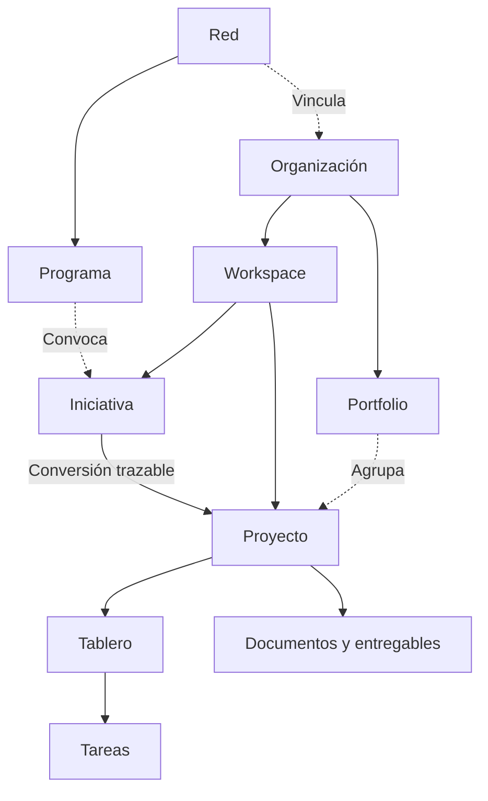

# Limites y contextos

## Jerarquía de responsabilidad

La organización constituye el ámbito de gobierno y contratación. El workspace establece contexto operativo, membresía y estándares. El proyecto concentra ejecución y evidencia. La iniciativa mantiene el expediente previo de evaluación cuando el contexto lo necesita.

Un portfolio agrupa proyectos para decisiones agregadas. Una red articula organizaciones y programas. Ambos son relaciones de coordinación, no atajos para adquirir acceso a todos los proyectos vinculados.

## Contextos de operación

| Contexto | Entrada habitual | Gobierno | Complejidad inicial |
| :--- | :--- | :--- | :--- |
| Personal | Proyecto directo | Propietario | Objetivo, siguiente paso y ejecución |
| Equipo | Proyecto directo o solicitud interna | Administrador y líder | Miembros, entregables y coordinación |
| Institucional | Iniciativa evaluada | Coordinación, mentoría y aprobación | Estándar, revisiones e historial |
| Programa de red | Iniciativa vinculada a convocatoria | Organización anfitriona y evaluadores autorizados | Colaboración externa y criterios del programa |

El código representa los modos de workspace como PERSONAL, TEAM e INSTITUTIONAL. Portfolio y Network son capacidades adicionales, no nuevos modos. No deben mezclarse modo operativo, plan comercial y rol de usuario.

## Separación de planos

El plano de identidad responde quién actúa. El de permisos responde sobre qué puede actuar. El comercial responde qué capacidades tiene contratadas la organización. El metodológico responde qué condiciones exige el proceso. Una acción se permite únicamente cuando cumple todos los planos relevantes.

Un plan con analítica no autoriza a leer proyectos privados. Un mentor puede participar en un proyecto sin gestionar facturación. Una organización puede contener workspaces con diferentes estándares sin duplicar la identidad del usuario.

## Propiedad de los recursos

Cada proyecto pertenece a un workspace. Cada tablero operativo debe pertenecer a un solo proyecto; pueden coexistir tableros heredados de workspace durante la transición, identificados para clasificación. Una tarjeta hereda el ámbito de su tablero.

Un documento puede ser una política del workspace o una evidencia de proyecto. Vincularlo a un proyecto exige coincidencia de workspace y autorización. Un equipo es reutilizable dentro de su workspace, pero su asignación a un proyecto tiene consecuencias de acceso que deben ser visibles.

Mover proyectos, equipos o documentos entre ámbitos requiere una operación específica que compruebe enlaces, participantes, capacidad y documentos. Cambiar un identificador mediante edición genérica no es una transferencia válida.

## Fronteras del alcance

Aether puede coordinar compromisos financieros y evidencias, pero esta especificación no lo convierte en contabilidad, firma electrónica certificada o gestión académica oficial. Integraciones futuras deben definir cuál sistema conserva autoridad sobre cada dato.

Los requisitos de conservación, consentimiento y contratos deben definirse con los responsables de cada despliegue. Esta bóveda establece controles de producto, no interpreta legislación ni certifica cumplimiento.

Véanse [[Modelo de dominio]], [[Planes y facturacion]] y [[Redes y programas]].
