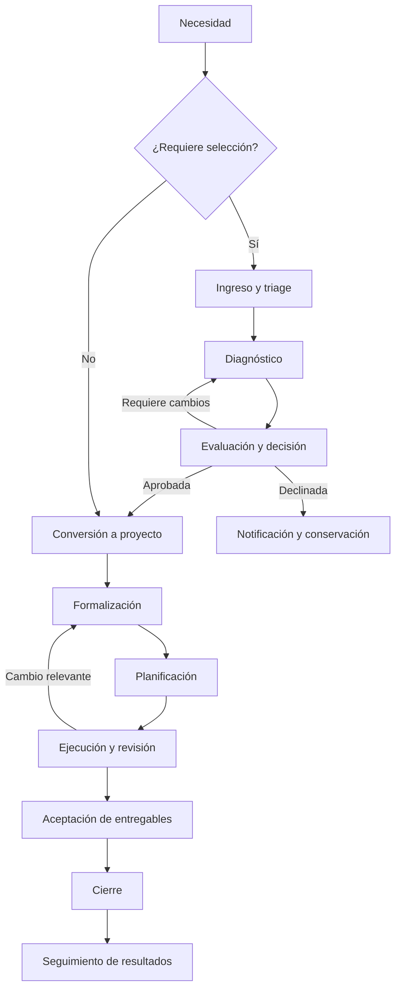

# Flujo integral

## Recorrido objetivo

Aether admite dos entradas: la iniciativa que requiere selección y el proyecto directo de un contexto personal o de equipo. Ambas convergen en un proyecto con responsabilidades y compromisos explícitos.

## Contrato de cada tramo

| Tramo | Responsable principal | Entrada | Salida verificable |
| :--- | :--- | :--- | :--- |
| Ingreso | Solicitante | Necesidad inicial | Expediente y acuse de recepción |
| Triage | Coordinador | Expediente recibido | Elegibilidad y persona asignada |
| Diagnóstico | Mentor y solicitante | Propuesta elegible | Problema y supuestos contrastables |
| Validación | Evaluador y aprobador | Evidencia y rúbrica | Decisión motivada |
| Conversión | Coordinador autorizado | Iniciativa aprobada | Proyecto único vinculado al origen |
| Formalización | Líder | Proyecto inicial | Alcance, estándar y responsabilidades aceptados |
| Planificación | Líder y equipo | Compromiso formalizado | Entregables, hitos, dependencias y capacidad |
| Ejecución | Equipo | Plan autorizado | Trabajo y evidencias actualizados |
| Aceptación | Aprobador o beneficiario | Entregables | Aceptación o devolución |
| Cierre | Líder | Entregables aceptados | Acta, pendientes y conservación |
| Seguimiento | Responsable de resultado | Producto entregado | Resultado medido y aprendizaje |

## Respuesta continua de la plataforma

Cada pantalla de expediente o proyecto debe responder qué es, dónde está, quién responde, qué falta, cuál es la siguiente acción, cuándo corresponde actuar y en qué evidencia se basa su estado. El sistema debe distinguir «espera del solicitante», «espera de revisión» y «bloqueo por recursos».

Toda transición produce un resultado confirmado. Si falla la notificación, la decisión permanece válida y el envío queda pendiente de reintento. Si falla la transacción de negocio, no se comunica una decisión exitosa.

## Variantes

Una propuesta rechazada mantiene el motivo y puede dar origen a otra versión o expediente relacionado. Una pausa conserva estado previo, motivo y próxima revisión. Una cancelación termina el compromiso con resultado «cancelado», diferente de completar satisfactoriamente.

La entrada directa omite el comité de selección cuando la política lo permite, pero sigue exigiendo los mínimos de formalización que correspondan. El usuario personal puede autorizar su propio avance; la institución puede exigir separación de funciones.

Las reglas detalladas están en [[Ingreso y triage]], [[Ciclo del proyecto]] y [[Cierre y aprendizaje]].
