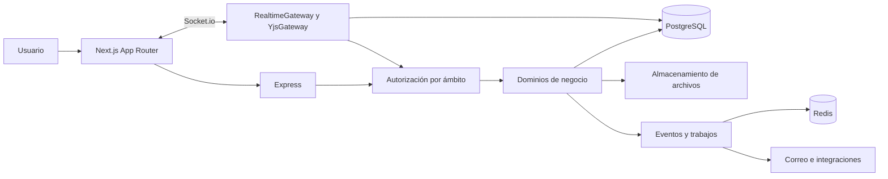

# Arquitectura tecnica

## Arquitectura observada

El repositorio es un monorepo pnpm con apps/web, apps/api y packages/shared-types. El frontend utiliza Next.js con App Router, React y TypeScript. El backend es una API Express independiente. Los endpoints de negocio están en Express; las páginas de Next.js no constituyen API Routes.

La persistencia utiliza PostgreSQL con Prisma y consultas SQL mediante pg. Redis participa en comunicación y otros servicios. Hay almacenamiento compatible con S3 mediante R2, correo Brevo, IA y automatizaciones GitHub.

## Precisión sobre tiempo real

Aunque la documentación antigua menciona dos servidores paralelos de WebSocket, el arranque inspeccionado inicializa YjsGateway usando realtimeGateway.getIO(). La implementación revisada transporta colaboración Yjs sobre Socket.io. No debe afirmarse la topología de un servidor Y-WebSocket separado únicamente porque la dependencia exista.

## Estructura objetivo

Mantener un backend modular con dominios de identidad, gobierno, iniciativas, proyectos, evidencia, portfolios, red y contratación. Los controladores traducen HTTP; los servicios ejecutan reglas; los repositorios gestionan persistencia. Las políticas de permisos se aplican de forma central y comprobable.

ProjectController e InitiativeController contienen lógica sustantiva. Extraer servicios de transición, conversión, cobertura y estándar permite probar reglas sin montar toda la aplicación. La extracción debe conservar contratos y migrarse por flujo, no exigir una reescritura completa.

## Fuente de verdad

La evidencia inspeccionada muestra escrituras relacionales junto con un registro de eventos. No demuestra reconstrucción integral del sistema mediante replay. Por tanto, la arquitectura actual se describe como persistencia relacional con eventos y colaboración en tiempo real.

La arquitectura objetivo recomendada conserva PostgreSQL como autoridad transaccional e incorpora outbox para entrega durable. Adoptar event sourcing integral requeriría una decisión separada, migración de todos los comandos y pruebas de reconstrucción que hoy no se acreditan.

## Contratos y dependencias

Compartir tipos facilita coherencia, pero no valida datos externos en ejecución. Los endpoints necesitan esquemas de entrada y salida. Las dependencias se instalan con lockfile congelado y runtime documentado. La versión del editor debe coincidir con el compilador del workspace.

Se observaron valores de puertos distintos entre configuración de API, frontend y valores por defecto. El arranque local debe tener una guía única con variables verificadas y detección de configuración incompatible.

Relaciones: [[Eventos y tiempo real]], [[Contratos de API]] y [[Operacion y continuidad]].
