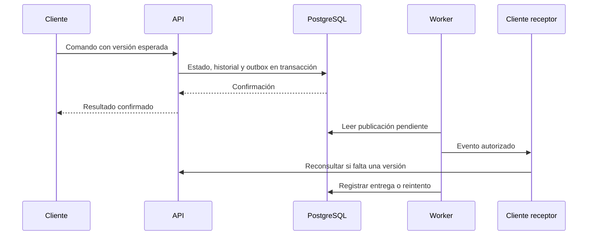

# Eventos y tiempo real

## Estado observado

EventStoreService persiste eventos no efímeros, publica en Redis e intenta distribuir por Socket.io. Algunos fallos de actividad, Redis y entrega se capturan sin hacer fallar la operación. El contador causal se mantiene en memoria por proceso.

YjsGateway mantiene documentos en memoria y usa guardado con espera de dos segundos y reintentos. Estos mecanismos ayudan a colaboración, pero no prueban entrega durable, reconstrucción integral, soporte offline completo ni consistencia multiinstancia.

## Separación de responsabilidades

| Mecanismo | Responsabilidad | Garantía requerida |
| :--- | :--- | :--- |
| Transacción relacional | Confirmar negocio | Atomicidad |
| Historial de decisión | Preservar fundamento | Inmutabilidad lógica |
| Outbox propuesta | Registrar publicación pendiente | No perder el hecho tras confirmar |
| Worker | Entregar y reintentar | Al menos una entrega |
| Consumidor | Aplicar efecto | Idempotencia |
| Socket.io | Actualizar clientes conectados | Autorización y recuperación |
| Yjs | Combinar ediciones | Convergencia del documento |
| Consulta HTTP | Recuperar estado autorizado | Lectura consistente con el contrato |

## Flujo objetivo

El sistema asume entrega repetida y hace idempotentes sus consumidores. No debe prometer «exactamente una vez» para efectos externos sin una garantía demostrable del proceso completo.

## Reconexión y acceso

Los canales deben estar vinculados a recursos autorizados. Pertenecer a la sala de workspace no justifica difundir nombres o contenido de proyectos privados. La implementación de eventos ya contiene una restricción para evitar ciertos broadcasts de proyecto y documento al workspace; la cobertura total exige pruebas.

Al reconectar, el cliente comprueba versión y recupera estado faltante. Una revocación cancela acceso tanto a nuevas suscripciones como a salas ya abiertas. La validación debe ocurrir también al editar y descargar.

## Documentos y durabilidad

Mostrar al usuario cuándo un cambio está sólo en memoria y cuándo fue persistido. Debe definirse el comportamiento ante caída dentro de la ventana de guardado. Para garantías mayores se propone persistir actualizaciones o lotes durables antes de anunciar confirmación.

CRDT resuelve combinación de contenido, pero no decide permisos, aprobación ni propiedad. Varias instancias requieren coordinación y una política de persistencia que evite sobrescribir versiones válidas.

Relaciones: [[Arquitectura tecnica]], [[Operacion y continuidad]] y [[Documentos y evidencia]].
