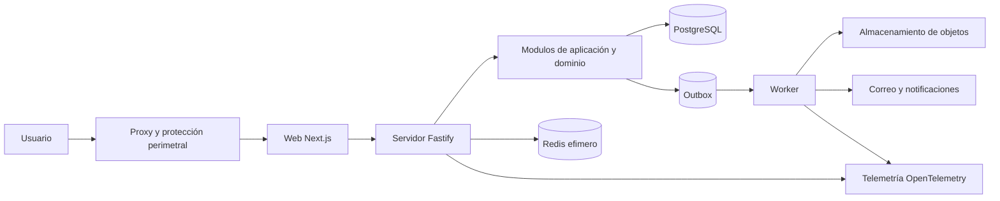

# Arquitectura objetivo greenfield

## Estilo adoptado

La plataforma comienza como un monolito modular con tres unidades desplegables: aplicación web, servidor de aplicación y worker. Comparten contratos y bibliotecas deliberadas, pero los módulos de dominio no importan controladores, ORM, proveedor de nube ni componentes de interfaz. Esta forma reduce la coordinación distribuida y mantiene una ruta de extracción si la evidencia futura la justifica.

## Capas por módulo

| Capa | Contenido | Dependencias permitidas |
| :--- | :--- | :--- |
| Dominio | Entidades, valores, políticas, invariantes y eventos de dominio | Lenguaje y utilidades puras |
| Aplicación | Casos de uso, transacciones, puertos, autorización contextual | Dominio y contratos de puertos |
| Infraestructura | PostgreSQL, almacenamiento, correo, identidad y telemetría | Aplicación, proveedores y adaptadores |
| Entrada | HTTP, WebSocket, trabajos y consola administrativa | Aplicación y contratos de transporte |

Las dependencias apuntan hacia el dominio. El servidor compone adaptadores en el borde. Un repositorio devuelve modelos del dominio o proyecciones explícitas, no objetos del ORM que se propaguen a toda la base de código.

## Consistencia

Las modificaciones de un agregado y su outbox se confirman en una transacción PostgreSQL. Los efectos externos son al menos una vez, por lo que los consumidores deben ser idempotentes. Cuando un caso cruza agregados dentro del mismo contexto, se define si exige atomicidad o una saga local observable. No se promete consistencia inmediata para correo, indexación, analítica o integraciones.

## Despliegue y escalado

Web, servidor y worker usan imágenes inmutables y escalan de forma independiente. El servidor no mantiene estado de sesión ni documentos solo en memoria. PostgreSQL es autoridad transaccional. Redis se limita a caché, control de frecuencia, presencia y coordinación efímera. El almacenamiento de objetos conserva binarios privados. Un proxy inverso aplica límites, encabezados y protección de tráfico antes de Next.js y la API.

## Criterios para extraer un servicio

| Señal | Evidencia necesaria |
| :--- | :--- |
| Escala distinta | Perfil de carga que demuestre contención imposible de resolver modularmente |
| Aislamiento de fallos | Incidentes donde un módulo comprometa objetivos de otro |
| Seguridad o regulación | Requisito de aislamiento de datos o equipo con control independiente |
| Ciclo de entrega | Equipos autónomos con contratos estables y costo de coordinación medido |

Una extracción requiere propiedad, SLO, contrato versionado, observabilidad, despliegue y guardia propios. Sin esas condiciones, aumenta el número de procesos pero no la independencia.

## Relaciones

Las tecnologías se fijan en [[Stack tecnologico y politica de versiones]]. Los límites se concretan en [[Estructura del repositorio y normas de desarrollo]] y [[Backend y reglas de dominio]].
